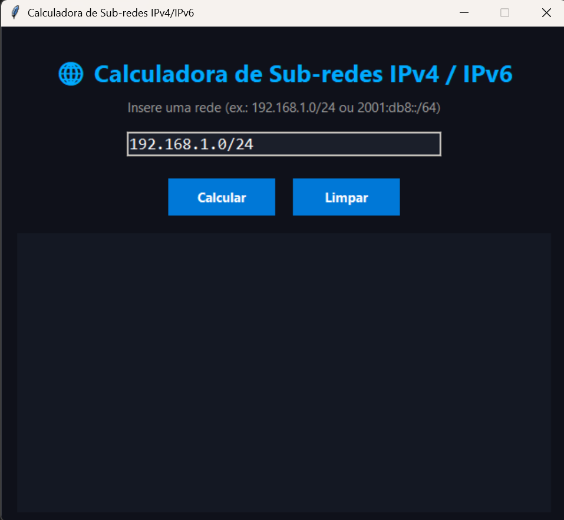

# 🌐 Calculadora de Sub-redes IPv4 e IPv6 (Python + Tkinter)

Uma aplicação gráfica moderna desenvolvida em **Python + Tkinter** que calcula informações de sub-redes **IPv4** e **IPv6**.  
Ideal para estudantes, técnicos e entusiastas de redes que querem compreender e visualizar endereçamento IP de forma prática e intuitiva.

---

## 📸 Pré-visualização



> Interface moderna com tema escuro, suporte IPv4 e IPv6, e botões de estilo profissional.

---

## 🧠 Funcionalidades

✅ Cálculo automático para **IPv4 e IPv6**  
✅ Mostra:
- Endereço de rede  
- Máscara de sub-rede (IPv4)  
- Wildcard (IPv4)  
- Broadcast (IPv4)  
- Tamanho do bloco (IPv6)  
- Tipo de endereço (público/privado)  
- Propriedades: Multicast, Loopback, Global  
✅ Interface moderna com **tema escuro e botões azuis**  
✅ Funciona **offline**, sem dependências externas  
✅ Compatível com **Windows, macOS e Linux**  

---

## ⚙️ Requisitos

- Python **3.8 ou superior**
- Módulo padrão **tkinter** (já incluído com o Python)

Verifica se o Tkinter está disponível:
```bash
python -m tkinter
